# Implementation Layer - HITL Linear Method (Final)

## Workflow

```
Goal → Clarification → Planning → Human Review → Implementation → Human Review → Push
```

---

## Detailed SOP

### 1. Goal Input & Clarification

**Human provides**: objective statement only

**Planner Agent**:

- analyzes objective
- **generates clarification questions**:
  - scope boundaries
  - success criteria
  - performance constraints
  - UX expectations
  - edge case handling
  - data persistence needs
- **interactive Q&A with human**
- **synthesizes into**:
  - acceptance criteria
  - constraints
  - preferences

**Output**: Validated goal specification

---

### 2. Planning Phase

**Planner Agent orchestrates parallel tasks:**

#### 2a. Skill Retriever

- scans available skills
- returns **all relevant skills** for given task
- provides skill docs for:
  - implementation patterns
  - testing strategies
  - domain-specific best practices

#### 2b. Explorer Agent (parallel execution)

**Information Layer Scan**:

- extracts journeys/stories matching goal
- pulls module boundaries
- fetches contracts (API/page/data)
- identifies behavioral dependencies

**Codebase State Scan**:

- locates existing implementations
- maps file structure
- detects conventions/patterns
- finds existing test coverage
- identifies integration points

#### 2c. Plan Generation

Planner synthesizes inputs into:

**Structured Plan**:

- behavioral requirements summary
- affected modules/files
- **test scenarios list** (what to test, not how)
- **edge cases inventory**
- implementation sequence (TDD steps)
- database changes needed (if any)
- integration touchpoints
- risk flags

**Plan Format**:

```markdown
## Goal
[refined from clarification]

## Acceptance Criteria
- [deterministic checkpoints]

## Test Coverage Required
- [scenario 1: description]
- [scenario 2: description]
- [edge case X]

## Implementation Steps
1. [step with test-first marker]
2. [step with implementation marker]
...

## Database Changes
- [if needed]

## Risks
- [potential blockers]
```

---

### 3. Human Review Loop

- approve/reject/iterate plan
- refine acceptance criteria
- adjust scope/priority

---

### 4. Implementation Phase

**Senior Developer Agent** executes plan with mandatory delegation:

#### 4a. Per-Step TDD Cycle

**For each implementation step**:

1. **Identify test need** (from plan test scenarios)
2. **MUST delegate to Test Writer Agent**:
   - provides: scenario description, context, acceptance criteria
   - Test Writer uses skills to generate high-quality tests
   - returns: test code
3. **Senior Developer integrates tests**
4. **Run tests** → expect failure
5. **Implement code**
6. **Run tests** → if fail, debug & fix
7. **Run tests** → pass → next step

#### 4b. Database Changes Delegation

**When plan requires schema changes**:

- **MUST delegate to DB Designer Agent**:
  - provides: data requirements from info layer
  - DB Designer generates:
    - schema definitions
    - migrations
    - constraints/indexes
  - returns: implementation-ready DB code

#### 4c. Terminal Actions Integration

Senior Developer invokes:

- `test` - after each code change
- `lint` - before marking step complete
- `typecheck` - after type-sensitive changes

Uses output to:

- self-correct failures
- validate conformance
- detect regressions

#### 4d. Progress Tracking

- marks completed steps
- surfaces blockers to human
- maintains plan coherence

---

### 5. Human Final Review

- manual code inspection
- acceptance testing
- performance validation
- **git push** (manual action)

---

## Agent Roster

| Agent | Role | Delegation Rule |
|-------|------|----------------|
| **Planner** | orchestration, clarification, synthesis | goal → actionable plan |
| **Skill Retriever** | knowledge extraction | returns ALL relevant skills |
| **Explorer** | dual-context scanning (parallel) | info layer + codebase state |
| **Senior Developer** | implementation orchestrator | implements + delegates to specialists |
| **Test Writer** | test code generation | ALWAYS delegated for test writing |
| **DB Designer** | data layer design | ALWAYS delegated for DB changes |

---

## Updated Orchestration Flow

```mermaid
graph TD
    H[👤 Human] -->|Goal Input| P[🤖 Planner Agent]
    
    P -->|Q&A Clarification| H
    H -->|Answers| P
    
    P -->|Spawn Parallel| SR[🤖 Skill Retriever]
    P -->|Spawn Parallel| EX[🤖 Explorer Agent]
    
    SR -->|ALL Relevant Skills| P
    EX -->|Info Layer + Codebase State| P
    
    P -->|Draft Plan| H
    H -->|Approve/Iterate| P
    
    H -->|Trigger Implementation| SD[🤖 Senior Developer]
    
    SD -->|MUST Delegate Tests| TW[🤖 Test Writer Agent]
    SD -->|MUST Delegate DB Changes| DB[🤖 DB Designer Agent]
    
    TW -->|Test Code| SD
    DB -->|Schema/Migrations| SD
    
    SD -->|Execute| TA[⚙️ Terminal Actions<br/>test/lint/typecheck]
    TA -->|Results| SD
    
    SD -->|Implementation Complete| H
    
    H -->|Manual Review & Approve| GP[⚙️ Git Push<br/>Human Action]
    
    classDef agent fill:#4A90E2,stroke:#2E5C8A,color:#fff
    classDef action fill:#50C878,stroke:#2E7D4E,color:#fff
    classDef human fill:#FF6B6B,stroke:#C92A2A,color:#fff
    
    class P,SR,EX,SD,TW,DB agent
    class TA,GP action
    class H human
```



---

## Key Design Principles

### 1. Mandatory Delegation

Senior Developer **MUST** delegate to specialist agents:

- **Test Writer**: for all test code
- **DB Designer**: for all database changes

Senior Developer never writes tests or DB code directly.

### 2. Human Control Points

- Goal clarification
- Plan approval
- Final code review
- Performance validation
- Git push

### 3. Parallel Efficiency

Skill Retriever + Explorer run concurrently during planning.

### 4. TDD Enforcement

Tests written before implementation, every step.

### 5. Terminal Feedback Loop

Test/lint/typecheck results drive Senior Developer self-correction.

---

## Implementation Layer Structure (Proposed)

```
.agents/
├─ docs/                          # information layer (already defined)
└─ workflows/
   └─ hitl-linear/
      ├─ README.md                # this document
      ├─ agents/
      │  ├─ planner.md            # role, inputs, outputs, skills
      │  ├─ skill-retriever.md
      │  ├─ explorer.md
      │  ├─ senior-developer.md
      │  ├─ test-writer.md
      │  └─ db-designer.md
      ├─ orchestration.md         # flow control rules
      ├─ delegation-rules.md      # when to delegate, what to pass
      └─ templates/
         ├─ plan-template.md      # structured plan format
         └─ clarification-qs.md   # common Q&A patterns
```

---

## Success Criteria

HITL workflow is successful when:

- Human provides only objective statement
- Plan contains deterministic acceptance criteria
- All tests written by Test Writer (never Senior Dev)
- All DB changes designed by DB Designer
- Implementation passes all tests before human review
- Human has full control at decision points
- No AI code review bottleneck

Human is in the loop at:

1. Goal clarification
2. Plan approval
3. Final review & push

Everything else: deterministic AI execution.
