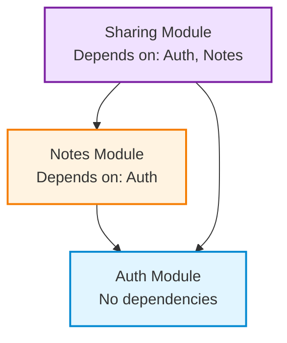

# [Product Name]

> _Example Product: **NoteFlow** - A simple note-taking app_

## Vision Statement

> _Defines the singular problem this product solves and the outcome it creates. Helps AI agents reject features outside core purpose._

**One-sentence product essence:**

[Your vision here]

**Example:** "Help people capture and organize thoughts instantly without complexity."

## Primary Users

> _Identifies who benefits from this product and who doesn't. Prevents AI from building features for wrong audience._

**Who uses this product:**

- **User Persona 1**: [role/context] — [core need]
- **User Persona 2**: [role/context] — [core need]

**Example:**

- **Students**: Take class notes and organize study materials
- **Writers**: Capture ideas and draft content quickly

**NOT for:**

- [explicitly excluded audiences]

**Example:** Enterprise teams needing advanced permissions and audit logs

## Technology Stack

> _Core technologies and platforms used. Helps AI understand technical constraints and available tools._

**Platform:**

- [Platform type: web app / mobile app / CLI / desktop / API]

**Primary Technologies:**

- **Language**: [e.g., TypeScript, Python, Go]
- **Runtime**: [e.g., Node.js, Deno, Browser]
- **Database**: [e.g., PostgreSQL, MongoDB, SQLite]
- **Storage**: [e.g., S3, local filesystem]

**Example:**

- **Platform**: Web application (browser-based)
- **Language**: TypeScript
- **Runtime**: Node.js (backend), Browser (frontend)
- **Database**: PostgreSQL
- **Storage**: AWS S3 for file uploads
- **Authentication**: Auth0

**Constraints:**

- Must work offline (requires local-first database)
- Must run on low-spec devices (limit bundle size)

## Core Value Proposition

> _Explains what makes this product valuable and different. AI uses this to prioritize features that strengthen core benefits._

**What makes this product valuable:**

1. **Primary Benefit**: [outcome user achieves]
2. **Secondary Benefit**: [additional value]
3. **Differentiator**: [what makes this unique]

**Example:**

1. **Instant capture**: Write thoughts without waiting for app to load
2. **Zero organization overhead**: Notes auto-organize by context
3. **Offline-first**: Works without internet, syncs when online

## Product Boundaries

> _Explicit scope fence defining what product does and doesn't do. Prevents feature creep and keeps AI focused._

### In Scope

- [capability 1: behavioral outcome]
- [capability 2: behavioral outcome]
- [capability 3: behavioral outcome]

**Example:**

- Create and edit text notes
- Organize notes in notebooks
- Search across all notes
- Tag notes for filtering
- User authentication and account management

### Out of Scope

- [explicitly excluded capability 1]
- [explicitly excluded capability 2]

**Example:**

- Real-time collaboration between users
- Rich media embedding (videos, audio)
- Version history and change tracking
- Built-in project management features

**Why excluded:**  
_Rationale for what this product will NOT do, ever._

**Example:** "We focus on individual note-taking. Collaboration requires different UX patterns and increases complexity. Users needing collaboration should use dedicated team tools."

## Modules Overview

> _Lists all bounded contexts (modules) in this product, their responsibilities, and dependencies. Helps AI understand product structure and navigate to detailed module documentation._

### [Module 1 Name]

**Responsibility:** [what this module owns]  
**Key Capabilities:** [high-level features]  
**Path:** `/docs/modules/[module-name]/`

### [Module 2 Name]

**Responsibility:** [what this module owns]  
**Key Capabilities:** [high-level features]  
**Path:** `/docs/modules/[module-name]/`

**Example:**

### Auth Module

**Responsibility:** User authentication, authorization, and session management  
**Key Capabilities:**

- User registration and login
- Session lifecycle management
- Password reset
- Account settings

**Path:** `/docs/modules/auth/`

### Notes Module

**Responsibility:** Note creation, editing, organization, and storage  
**Key Capabilities:**

- Create/edit/delete notes
- Organize notes into notebooks
- Apply tags to notes
- Move notes to trash (soft delete)

**Path:** `/docs/modules/notes/`

### Sharing Module

**Responsibility:** Allow users to share notes with others via public links  
**Key Capabilities:**

- Generate shareable links for notes
- Set expiration dates on shared links
- Track view counts on shared notes
- Revoke shared links

**Path:** `/docs/modules/sharing/`

## Module Dependencies

> _Defines relationships between modules. Helps AI understand data flow and integration points. Prevents circular code dependencies while allowing bidirectional data relationships._

**Dependency Graph:**



**Detailed Dependencies:**

- **Notes Module** → depends on **Auth Module**
  - Reason: Notes must belong to authenticated user
  
- **Sharing Module** → depends on **Auth Module**, **Notes Module**
  - Reason: Share links require ownership verification (Auth) and note content (Notes)

**Rules:**

- Auth Module has no dependencies (foundation layer)
- Modules communicate via defined contracts/APIs only
- Bidirectional data relationships allowed (e.g., User ↔ Payment via foreign keys)
- Circular code dependencies forbidden (Module A imports Module B, Module B imports Module A)

## Cross-Module Product Rules

> _Behavioral invariants that span multiple modules. These are product-wide constraints that all modules must respect._

- [rule 1: cross-module invariant]
- [rule 2: cross-module invariant]
- [rule 3: cross-module invariant]

**Example:**

- **Free tier limit**: Maximum 100 notes total (enforced by Notes + Auth modules)
- **30-day trash retention**: All deleted items (notes, notebooks) retained 30 days before permanent deletion (applies to Notes module)
- **Data isolation**: User can only access their own data, never other users' data (enforced by Auth + Notes + Search modules)
- **Offline-first**: All modules must work offline, sync when connection available (enforced by Sync module)
- **Auto-save interval**: All editable content auto-saves every 3 seconds (Notes module)

## Non-Goals

> _What this product deliberately does NOT optimize for. Prevents scope creep and helps AI reject out-of-scope feature requests._

**What this product will NOT do:**

- [anti-goal 1]
- [anti-goal 2]
- [anti-goal 3]

**Example:**

- Enterprise-grade user permissions and roles
- Team workspaces and shared notebooks
- Advanced formatting (tables, charts, diagrams)
- AI-generated content suggestions
- Integration with third-party productivity tools

**Rationale:**  
_Explain why these are excluded._

**Example:** "We optimize for simple, fast individual note-taking. Enterprise features add complexity and slow down core workflows. Users needing collaboration should use dedicated team tools."

## Assumptions & Dependencies

> _Explicit assumptions about users and external systems. Helps AI validate if implementation environment matches product requirements._

### Assumptions

- [assumption 1]
- [assumption 2]

**Example:**

- Users have email address for account creation
- Users understand basic text editing (typing, selecting, deleting)
- Users access app via modern web browser (Chrome, Firefox, Safari) or mobile app
- Users have stable internet connection for initial sync (works offline afterward)

### External Dependencies

- [dependency 1: service/system this product relies on]
- [dependency 2: service/system this product relies on]

**Example:**

- Third-party authentication service for user login (e.g., Auth0)
- Cloud storage provider for note persistence (e.g., AWS S3)
- Email delivery service for password reset (e.g., SendGrid)

## Glossary

> _Product-wide terminology used consistently across all modules and documentation. Prevents ambiguity in behavioral descriptions. Module-specific terms live in module READMEs._

**Product-level terminology:**

- **[Term 1]**: [definition in user context]
- **[Term 2]**: [definition in user context]

**Example:**

- **User**: A registered account holder who can create and manage notes
- **Note**: A single text document created by user
- **Notebook**: A collection of related notes
- **Tag**: A user-defined label for categorizing notes
- **Trash**: Temporary storage for deleted items (30-day retention)
- **Archive**: Long-term storage for notes user wants to hide from active view
- **Sync**: Process of updating data across user's devices

_Module-specific terms are defined in respective module READMEs._

## Information Architecture

> _Directory structure showing where AI agents find behavioral knowledge. Each path contains specific types of product information._

```
<root>/
└─ docs/                             # complete behavioral knowledge base
   ├─ README.md                      # product vision, scope, constraints
   ├─ journeys/                      # end-to-end behavioral outcomes
   │  ├─ <journey>.md                # narrative + acceptance truth
   │  └─ <journey>.mermaid           # visual behavior flow
   └─ modules/                       # domain-isolated knowledge units
      └─ <module>/                   # single bounded context
         ├─ README.md                # responsibilities + boundaries
         ├─ CONTRIBUTING.md          # documentation rules for this module
         ├─ user-stories/            # atomic behavioral goals
         │  ├─ <story>.md            # intent + acceptance criteria
         │  └─ <story>.mermaid       # story interaction flow
         ├─ database-design.md       # domain entities + relationships
         ├─ frontend/                # user experience definition only
         │  └─ pages/                # URL-level behavioral surfaces
         │     └─ <page>/            # single user interaction boundary
         │        ├─ README.md       # goals, content, user actions
         │        └─ ui.md           # layout wireframe (ASCII)
         ├─ background/              # non-UI system capabilities
         │  └─ api/                  # behavioral API contracts
         │     └─ <route>/           # endpoint semantic boundary
         │        ├─ README.md       # params, responses, rules, errors
         │        └─ tests.md        # behavioral verification cases
         └─ backend/                 # domain logic description only
```

**Authority Hierarchy:**

When documentation conflicts, higher authority wins:

```
docs/README.md > journeys/*.md > modules/*/README.md > user-stories/*.md > pages/*/README.md > database-design.md
```

## Change Guardrails

> _Rules governing how product evolves over time. Prevents AI from breaking existing user workflows when adding new features._

**When modifying this product:**

✅ **DO:**

- Add new features as opt-in enhancements
- Preserve existing user workflows unchanged
- Make advanced features discoverable but not intrusive
- Maintain backward compatibility with user data
- Keep module boundaries clear (don't leak responsibilities)
- Allow bidirectional data relationships between modules (e.g., User ↔ Payment via foreign keys)
- Use well-defined contracts/APIs for inter-module communication

❌ **DON'T:**

- Remove features users depend on
- Change default behaviors without user consent
- Require users to relearn core workflows
- Break existing data formats or API contracts
- Create circular code dependencies (Module A imports Module B, Module B imports Module A)
- Directly couple module implementations (modules should communicate via contracts)

**Example Scenarios:**

**Good change:** Add rich text formatting as optional toggle in Notes module — plain text remains default  
**Bad change:** Force all notes to use rich text editor

**Good change:** Add new Archive feature to Notes module alongside existing Trash  
**Bad change:** Replace Trash with Archive (breaks user mental model)

**Good change:** Add social login to Auth module as additional option  
**Bad change:** Remove email/password login (breaks existing users)

**Good change:** Payment module stores `user_id` reference, Auth module stores `payment_provider_id` (bidirectional data)  
**Bad change:** Payment module directly imports and calls Auth module code (circular code dependency)

## Architectural Philosophy (Conceptual)

> _High-level design principles guiding technical decisions across all modules. Helps AI choose implementation approaches aligned with product values. No specific technologies mentioned._

**Guiding principles:**

- **[Philosophy 1]**: [conceptual approach]
- **[Philosophy 2]**: [conceptual approach]
- **[Philosophy 3]**: [conceptual approach]

**Example:**

- **Offline-first**: All modules work without internet, sync when connection available
- **Fast by default**: User interactions feel instant (<100ms perceived latency)
- **Data durability**: Favor preserving user data over feature convenience (always confirm destructive actions)
- **Graceful degradation**: If one module fails, others continue working
- **Module isolation**: Modules communicate via defined contracts, no direct coupling

_No frameworks, languages, or infrastructure mentioned._

## AI Agent Development Workflow

> _Step-by-step process for AI agents working on this product. Covers understanding, planning, implementation, validation, and maintenance across the entire development lifecycle._

### Phase 1: Understanding Product Context

**When starting any task:**

1. Read **this README** for:
   - Product vision and value proposition
   - Module overview and responsibilities
   - Cross-module product rules
   - Change guardrails and architectural philosophy

2. Review **module dependency graph** to understand:
   - Which modules your task affects
   - Integration points between modules
   - Data flow and relationships

3. Read **relevant module READMEs** for:
   - Domain model (entities and relationships)
   - Module-specific rules
   - UX philosophy
   - Boundaries and responsibilities

4. Review **journeys** that involve your task:
   - End-to-end user flows
   - Acceptance criteria
   - Cross-module interactions

**Determinism Check:**  
_Can you explain what your task affects without reading code?_  
If no → documentation incomplete, ask human for clarification.

### Phase 2: Planning Changes

**Before writing any code:**

1. **Identify affected modules:**
   - Which module owns this feature?
   - Which modules does it integrate with?

2. **Check constraints:**
   - Review cross-module product rules
   - Check module boundaries (scope creep?)
   - Verify architectural philosophy alignment

3. **Validate dependencies:**
   - Will this create new module dependencies?
   - Are circular code dependencies introduced?
   - Are bidirectional data relationships needed?

4. **Draft implementation plan:**
   - Write acceptance criteria
   - List test scenarios
   - Identify edge cases
   - Note documentation updates needed

5. **Human review checkpoint:**
   - Present plan to human
   - Get approval before implementation

### Phase 3: Implementation

**During development:**

1. **Test-Driven Development (TDD):**
   - Write tests first (delegate to Test Writer Agent)
   - Run tests → expect failure
   - Implement code
   - Run tests → pass

2. **Respect module boundaries:**
   - Implement within assigned module only
   - Use contracts/APIs for inter-module communication
   - Don't leak responsibilities to other modules

3. **Follow UX philosophy:**
   - Adhere to module's interaction patterns
   - Maintain consistency with existing flows
   - Don't break user mental models

4. **Apply architectural philosophy:**
   - Offline-first (if applicable)
   - Fast by default
   - Data durability
   - Graceful degradation

5. **Database changes (if needed):**
   - Delegate to DB Designer Agent
   - Update `database-design.md`
   - Maintain referential integrity

### Phase 4: Validation

**Before marking task complete:**

1. **All tests pass:**
   - Unit tests
   - Integration tests
   - Edge case coverage

2. **Cross-module rules respected:**
   - No violations of product-wide constraints
   - Module boundaries maintained

3. **Dependencies validated:**
   - Module dependency graph unchanged (or explicitly updated in README)
   - No circular code dependencies introduced

4. **User journeys still achievable:**
   - Affected journeys still work end-to-end
   - Acceptance criteria met

5. **Change guardrails followed:**
   - Existing user workflows preserved
   - Backward compatibility maintained
   - No breaking changes

### Phase 5: Documentation Maintenance

**After implementation complete:**

1. **Update module README if:**
   - New entities added to domain model
   - New module rules introduced
   - Module responsibilities changed
   - UX philosophy evolved

2. **Update this product README if:**
   - New module added
   - Module dependencies changed
   - Cross-module rules added/modified
   - Product boundaries changed

3. **Update journeys if:**
   - User flow changed
   - New steps added to existing journey
   - Acceptance criteria modified

4. **Update glossary if:**
   - New product-wide terminology introduced
   - Existing terms redefined

5. **Update user stories if:**
   - Acceptance criteria changed
   - New stories added
   - Stories deprecated

**Documentation First Principle:**  
_If behavior changed, documentation MUST change before code is merged._

### Common Workflows

**Adding a new feature:**

```
Phase 1 → Phase 2 → Human Review → Phase 3 → Phase 4 → Phase 5
```

**Fixing a bug:**

```
Phase 1 (understand affected modules) → Phase 3 (TDD fix) → Phase 4 (validate) → Phase 5 (if behavior changed)
```

**Refactoring:**

```
Phase 1 → Phase 4 (ensure no behavioral changes) → Phase 5 (update only if module boundaries changed)
```

### Escalation Points

**When to ask human for help:**

- Documentation conflicts detected (multiple sources of truth)
- Proposed change violates change guardrails
- Cross-module rules unclear or contradictory
- Module boundaries ambiguous
- Breaking change unavoidable
- New module needed (requires product-level decision)

## Notes for Future AI Agents

- **This document defines WHAT at product level, never HOW**
- **All product-wide behavioral truth flows from here**
- **Module-specific details live in module READMEs**
- **If contradictions found, this README wins**
- **Implementation may change; product definition must not**
