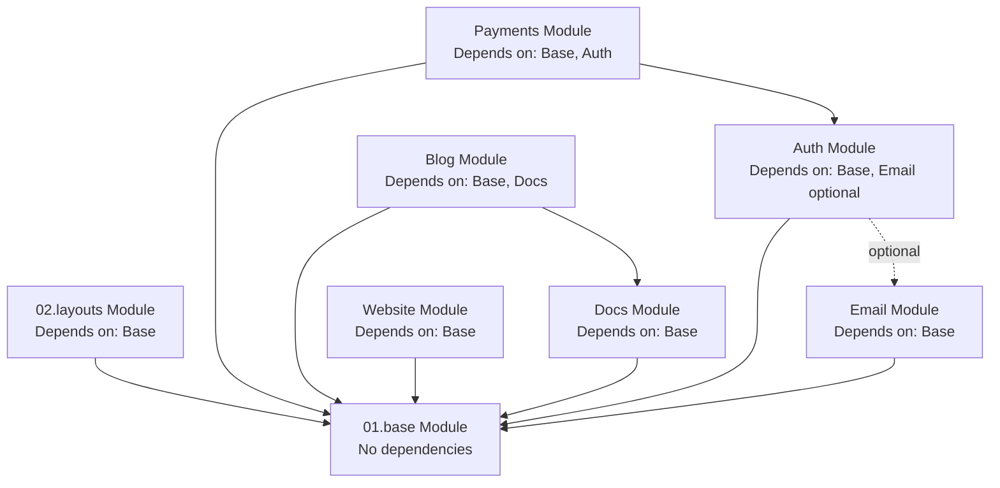

# NuxtStart

> _A production-ready Nuxt starter kit with authentication, payments, and content management built-in._

## Vision Statement

> _Defines the singular problem this product solves and the outcome it creates. Helps AI agents reject features outside core purpose._

**One-sentence product essence:**

Provide developers with a production-ready Nuxt foundation that includes authentication, payments, and content management, eliminating months of boilerplate setup and enabling rapid SaaS product launches.

## Primary Users

> _Identifies who benefits from this product and who doesn't. Prevents AI from building features for wrong audience._

**Who uses this product:**

- **Solo Developers**: Building SaaS products independently — need complete foundation to launch quickly without building infrastructure from scratch
- **Startups & Small Teams**: Launching MVPs and validating ideas — require production-ready codebase to move fast and focus on unique business logic
- **Agencies**: Building client projects on tight timelines — need reliable, well-structured foundation they can customize and extend
- **Freelancers**: Delivering full-stack web applications — benefit from pre-built essentials (auth, payments, content) to maximize billable feature work

**NOT for:**

- **Nuxt Beginners**: Those learning the framework — requires intermediate+ knowledge of Nuxt, Vue, and TypeScript
- **Mobile-First Projects**: Native or mobile-first applications — optimized for web applications, not React Native or Capacitor
- **Static Sites Without Auth**: Simple content sites — includes authentication/database infrastructure unnecessary for static publishing

## Technology Stack

> _Core technologies and platforms used. Helps AI understand technical constraints and available tools. Document WHAT technologies are used, never HOW they are implemented._

**Platform:**

- Web application (browser-based, server-side rendered)

**Primary Technologies:**

- **Language**: TypeScript
- **Framework**: Nuxt (Vue 3 full-stack SSR framework)
- **Database**: PostgreSQL
- **ORM**: Drizzle ORM with drizzle-zod for schema validation
- **State Management**: Pinia
- **UI Library**: @nuxt/ui (125+ accessible components with Tailwind CSS)
- **Authentication**: better-auth with @polar-sh/better-auth extensions
- **Payment Processing**: @polar-sh/sdk (Polar payment platform)
- **Content Management**: @nuxt/content (markdown-based)
- **Email Service**: unemail (multi-provider abstraction)
- **Storage**: AWS S3 (via aws4fetch)
- **SEO**: @nuxtjs/seo (sitemap, meta tags, OG images, schema-org)
- **Image Optimization**: @nuxt/image with Vercel provider support

**Development Tools:**

- ESLint with @antfu/eslint-config and custom rules
- Vitest (unit testing with Vue Test Utils)
- Husky + lint-staged (pre-commit hooks)
- commitlint (conventional commit messages)
- Drizzle Kit (database migrations)

**Notes:**

- Uses PostgreSQL as the recommended database
- Optimized for Vercel deployment with custom configurations
- Supports modern browsers
- OAuth works with Google and GitHub providers by default
- File storage uses AWS S3 or S3-compatible services

## Core Value Proposition

> _Explains what makes this product valuable and different. AI uses this to prioritize features that strengthen core benefits._

**What makes this product valuable:**

1. **Nuxt Layers Architecture**: Modular layer-based organization enables clean separation of concerns, easy customization, and selective feature adoption in child projects
2. **Production-Ready Essentials**: Authentication (OAuth + email/password + magic link), payment processing (Polar), content management (blog/docs), and email service pre-integrated and tested
3. **SEO Pre-Configured**: Sitemap generation, Open Graph images, meta tags, and structured data work out-of-box without additional setup
4. **Best Practices Built-In**: Type-safe database queries, custom ESLint rules enforcing naming conventions, comprehensive testing setup, and pre-commit quality gates
5. **Easy Extensibility**: Well-documented architecture with clear module boundaries allows developers to add custom features without breaking existing functionality
6. **High Code Quality**: TypeScript throughout, automated linting, testing infrastructure, and semantic commit enforcement ensure maintainable codebase
7. **Comprehensive Documentation**: AI-first documentation in `/docs` guides both human developers and AI agents through architecture, patterns, and extension points

## Product Boundaries

> _Explicit scope fence defining what product does and doesn't do. Prevents feature creep and keeps AI focused. Includes both capabilities we build and deliberate exclusions with rationale._

### What We Build (In Scope)

**Authentication & User Management:**
- User registration and email verification
- Email/password and magic link authentication
- OAuth social login (Google, GitHub)
- Account linking across providers
- Session management and admin impersonation

**Payment & Subscription:**
- Polar payment integration with checkout flows
- Subscription and order management
- Customer portal and webhook handling
- Usage tracking for metered billing

**Content Management:**
- Markdown-based blog and documentation
- Legal/marketing content pages
- SEO-optimized rendering with sitemaps

**Email Communication:**
- Multi-provider email service setup
- Transactional email templates
- Multi-sender configuration

**Infrastructure:**
- PostgreSQL database with type-safe ORM
- AWS S3 file storage
- Testing infrastructure and code quality tools
- Environment-based configuration

**UI Foundation:**
- Component library with dark/light mode
- Responsive layouts and animations

### What We Don't Build (Deliberate Exclusions)

**Current Exclusions:**

- **Mobile app support**: Focused on web applications only
- **Complex workflow automation**: Visual builders, scheduling engines
- **Built-in CMS for non-technical users**: Uses markdown-based content for developers
- **Framework alternatives**: Nuxt-specific, not Next.js/SvelteKit/Remix
- **Database alternatives**: PostgreSQL-optimized schemas

**Planned for Future:**

- **Advanced admin dashboards**: Analytics, reporting, audit logs, system monitoring
- **Multi-tenancy & team workspaces**: Team collaboration, member management, role-based access

## Modules Overview

> _Lists all bounded contexts (modules) in this product, their responsibilities, and dependencies. Helps AI understand product structure and navigate to detailed module documentation._

**Note on Terminology**: In NuxtStart, "Layer" is the technical Nuxt term for code organization, while "Module" is the conceptual term for bounded contexts. Each Nuxt Layer represents one module. Documentation uses "module" to describe responsibilities and boundaries.

**Note on Modularity**: Modules are organized separately for code structure and maintainability, not strict isolation. Modules can communicate with each other and import from one another. Child projects can remove unused modules (e.g., blog, docs, payments) though some configuration changes outside the module may be required.

### 01.base Module

**Responsibility:** Foundation layer providing core infrastructure, database schemas, utilities, and shared configuration  
**Key Capabilities:**

- PostgreSQL database schemas and migrations
- Shared utilities, composables, and stores
- Base middleware (global query parameter validation)
- Transition CSS animations
- App configuration defaults
- Nuxt UI customization configuration

**Path:** `/layers/01.base/`

### 02.layouts Module

**Responsibility:** Application layout components and layout-specific styling  
**Key Capabilities:**

- Layout components for consistent page structure
- Layout-specific composables and utilities
- Brand assets and styling overrides

**Path:** `/layers/02.layouts/`

### Auth Module

**Responsibility:** User authentication, authorization, session management, and account administration  
**Key Capabilities:**

- BetterAuth server setup with OAuth (Google, GitHub), magic link, email verification
- Database tables: users, sessions, accounts, verifications
- Auth middleware (public, private, guest, admin page groups)
- Auth pages: sign-in, sign-up, email verification, magic link
- User account management pages
- Admin functionality with user impersonation

**Path:** `/layers/auth/`

### Blog Module

**Responsibility:** Markdown-based blog content management and rendering  
**Key Capabilities:**

- Markdown blog posts with frontmatter (title, description, image, date, category)
- Blog post rendering with syntax highlighting
- Category-based organization
- Prerendered static pages at build time

**Path:** `/layers/blog/`

### Docs Module

**Responsibility:** Documentation site with markdown content and custom plugins  
**Key Capabilities:**

- Markdown documentation pages
- Custom markdown plugins (code snippet imports)
- Syntax highlighting (github-light/dracula themes)
- Prerendered static documentation site

**Path:** `/layers/docs/`

### Email Module

**Responsibility:** Email service abstraction and template management  
**Key Capabilities:**

- Multi-provider email service (AWS SES, Resend, SMTP)
- Provider configuration based on environment
- Email templates (verification, magic link, password reset, welcome)
- Multi-sender support (security, events, alerts, system)
- Admin notification capabilities

**Path:** `/layers/email/`

### Payments Module

**Responsibility:** Payment processing, subscription management, and order tracking via Polar  
**Key Capabilities:**

- Database tables: orders, subscriptions, products
- Polar SDK client setup
- Checkout integration (guest + authenticated user support)
- Customer portal integration
- Usage tracking for metered billing
- Webhook handling for payment events
- Order and subscription management

**Path:** `/layers/payments/`

### Website Module

**Responsibility:** Public-facing website pages and legal/marketing content  
**Key Capabilities:**

- Public website pages
- Legal/marketing content via Nuxt Content
- Markdown-based content management for terms, privacy, etc.

**Path:** `/layers/website/`

## Module Dependencies

> _Defines relationships between modules. Helps AI understand data flow and integration points. Prevents circular code dependencies while allowing bidirectional data relationships._

**Dependency Graph:**



**Detailed Dependencies:**

- **02.layouts Module** → depends on **01.base Module**
  - Reason: Layouts use base utilities, composables, and Nuxt UI configuration

- **Auth Module** → optionally depends on **01.base Module**, **Email Module**
  - Reason: Auth uses base database utilities; email integration is optional (wired to send auth emails but can work without it)

- **Blog Module** → depends on **01.base Module**, **Docs Module**
  - Reason: Blog uses base Nuxt Content configuration, shared utilities, and docs layer components

- **Docs Module** → depends on **01.base Module**
  - Reason: Docs uses base Nuxt Content configuration and custom markdown plugins

- **Email Module** → depends on **01.base Module**
  - Reason: Email uses base configuration and environment utilities

- **Payments Module** → depends on **01.base Module**, **Auth Module**
  - Reason: Payments require user authentication for customer linking and uses base database utilities

- **Website Module** → depends on **01.base Module**
  - Reason: Website uses base Nuxt Content configuration and shared utilities

**Notes:**

- 01.base Module has no dependencies (foundation layer)
- Modules can freely communicate and import from each other for code reuse
- Bidirectional data relationships allowed via foreign keys
- Child projects can remove unused modules with minor configuration adjustments

## Cross-Module Product Rules

> _Product-wide standards and conventions that maintain consistency across all modules._

**Naming Conventions:**

- Database table names use snake_case
- Database type names follow pattern: `{TableName}Schema`, `New{TableName}`, `{TableName}`
- Zod schemas for database validation use snake_case
- Conventional commit message format required

**Architecture Standards:**

- Each module is a self-contained Nuxt Layer with `nuxt.config.ts`
- Shared configuration centralized in 01.base module
- Server code in `server/`, client code in `app/`
- Database schemas in module's `server/db/schemas/`

**Security Requirements:**

- Private pages require authenticated session via middleware
- Password reset emails use `security` sender category
- OAuth callbacks validate state parameter
- Session tokens are HTTP-only cookies
- User data isolation enforced

**Quality Standards:**

- TypeScript strict mode enabled
- Database migrations generated via Drizzle Kit
- Environment variables validated on startup
- Public routes generate sitemap entries
- Dark/light mode support for user-facing content

## Assumptions & Dependencies

> _Explicit assumptions about users and external systems. Helps AI validate if implementation environment matches product requirements._

### Assumptions

**Developer Knowledge:**

- Developers have intermediate or advanced understanding of Nuxt 3+ and Vue 3 Composition API
- Developers are comfortable writing TypeScript with strict mode enabled
- Developers understand relational database concepts and SQL basics
- Developers familiar with Drizzle ORM syntax for type-safe queries
- Developers understand OAuth authentication flows and security best practices
- Developers have Git version control experience
- Developers can work with command-line tools (npm/pnpm, drizzle-kit, etc.)

**Development Environment:**

- Developers have Node.js installed
- Developers have PostgreSQL server available (local or remote)
- Developers can configure environment variables via `.env` files
- Developers have modern code editor with TypeScript support (VS Code recommended)
- Developers can run Docker containers for local PostgreSQL (optional but recommended)

**Deployment Environment:**

- Production environment supports Node.js server-side rendering
- Vercel deployment preferred (optimizations included)
- HTTPS enabled for OAuth callbacks and secure cookies

### External Dependencies

**Required Services:**

- **PostgreSQL Database Server**: Relational database for all persistent data (users, sessions, orders, content metadata)
- **Email Provider**: One of AWS SES, Resend, or SMTP server for transactional emails (verification, password reset, notifications)
- **Payment Provider**: Polar account and API credentials for payment processing and subscription management
- **AWS S3 or S3-Compatible Storage**: Object storage for user-uploaded files and static assets

**Optional Services:**

- **OAuth Provider Apps**: Google OAuth 2.0 app and/or GitHub OAuth app for social authentication (can disable if not needed)
- **Vercel**: Recommended hosting platform with built-in optimizations (can deploy elsewhere with adjustments)

**Development-Only Dependencies:**

- **MailPit or Similar**: Local SMTP server for testing emails in development (port 1025)
- **Docker**: For running PostgreSQL locally via containers (alternative to native install)

**Third-Party SDK Dependencies:**

- Polar SDK for payment API communication
- Better Auth for authentication flows
- AWS SDK (aws4fetch) for S3 signed requests

## Glossary

> _Product-wide terminology used consistently across all modules and documentation. Prevents ambiguity in behavioral descriptions. Module-specific terms live in module READMEs._

**Product-level terminology:**

- **NuxtStart**: The starter kit product itself; provides production-ready Nuxt foundation
- **Layer**: Technical Nuxt term for code organization unit; synonymous with "Module" in conceptual documentation
- **Module**: Bounded context representing one domain area (auth, payments, blog, etc.); implemented as Nuxt Layer
- **Child Project**: An application built using NuxtStart as foundation; extends starter with custom modules and business logic
- **Base Module (01.base)**: Foundation layer providing core infrastructure, database, utilities, and shared configuration; no dependencies
- **Content Collection**: Organized group of markdown files (blog posts, docs pages, legal content) managed by Nuxt Content

_Module-specific terms (e.g., "checkout flow", "impersonation", "usage tracking") are defined in respective module READMEs._

## Information Architecture

> _Directory structure showing where AI agents find behavioral knowledge. Each path contains specific types of product information._

```
<root>/
├─ docs/                             # complete behavioral knowledge base
│  ├─ README.md                      # product vision, scope, constraints (THIS FILE)
│  ├─ user-journeys/                 # end-to-end behavioral outcomes
│  │  └─ <journey>.md                # narrative + acceptance truth
│  └─ modules/                       # domain-isolated knowledge units
│     └─ <module>/                   # single bounded context
│        ├─ README.md                # responsibilities + boundaries
│        ├─ user-stories/            # atomic behavioral goals
│        │  └─ <story>.md            # intent + acceptance criteria
│        ├─ database-design.md       # domain entities + relationships
│        ├─ frontend/                # user experience definition only
│        │  └─ pages/                # URL-level behavioral surfaces
│        │     └─ <page>/            # single user interaction boundary
│        │        ├─ README.md       # goals, content, user actions
│        │        └─ wireframe.md    # indented spacing + ASCII mini-map wireframe
│        └─ backend/                 # non-UI system capabilities
│           └─ api/                  # behavioral API contracts
│              └─ <route>/           # endpoint path boundary
│                 └─ <method>/       # HTTP method (get, post, patch, delete, etc.)
│                    ├─ README.md    # params, responses, rules, errors
│                    └─ tests.md     # behavioral verification cases
└─ layers/                           # actual implementation (code)
   ├─ 01.base/                       # base module implementation
   ├─ 02.layouts/                    # layouts module implementation
   ├─ auth/                          # auth module implementation
   ├─ blog/                          # blog module implementation
   ├─ docs/                          # docs module implementation
   ├─ email/                         # email module implementation
   ├─ payments/                      # payments module implementation
   └─ website/                       # website module implementation
```

**Authority Hierarchy:**

When documentation conflicts, higher authority wins:

```
docs/README.md > journeys/*.md > modules/*/README.md > user-stories/*.md > pages/*/README.md > database-design.md
```

## Architectural Philosophy (Conceptual)

> _High-level design principles guiding technical decisions across all modules. Helps AI choose implementation approaches aligned with product values. No specific technologies mentioned._

**Guiding principles:**

- **Modularity via Layers**: Organize code into Nuxt Layers (modules) for better structure; modules can communicate and import from each other; child projects can remove unused modules
- **Type Safety First**: Leverage TypeScript strict mode throughout; validate data at boundaries with Zod; generate types from database schemas
- **Convention Over Configuration**: Use Nuxt auto-imports, file-based routing, and naming conventions to reduce boilerplate; custom ESLint rules enforce consistency
- **Progressive Enhancement**: Core features work without JavaScript; enhance with client-side interactivity where valuable
- **Developer Experience**: Optimize for fast feedback loops with pre-commit hooks, type checking, automated testing, and clear error messages
- **Production-Ready Defaults**: Configure SEO, security headers, error handling, email templates, and database migrations out-of-box
- **Customizable Foundation**: Child projects can modify and customize source code as needed; this is a starter kit, not a rigid framework
- **Best Practices Enforced**: Use linting rules, type checking, and pre-commit hooks to prevent common mistakes
- **Documentation-Driven**: Document behavioral intent in `/docs` before implementation; AI agents and developers use documentation as source of truth
- **Separation of Concerns**: Organize authentication, payments, content, and email into distinct modules for maintainability

## AI Agent Development Workflow

> _Step-by-step process for AI agents working on this product. Covers understanding, planning, implementation, validation, and maintenance across the entire development lifecycle._

### Phase 1: Understanding Product Context

**When starting any task:**

1. Read **this README** for:
   - Product vision and value proposition (what makes NuxtStart unique)
   - Module overview and responsibilities (which modules own what)
   - Cross-module product rules (code quality, architecture, security)
   - Change guardrails and architectural philosophy (how to evolve without breaking)

2. Review **module dependency graph** to understand:
   - Which modules your task affects
   - Integration points between modules (e.g., Auth → Email for verification)
   - Data flow and relationships (e.g., Payments depends on Auth for user linking)

3. Read **relevant module READMEs** for:
   - Domain model (entities and relationships)
   - Module-specific rules and boundaries
   - UX philosophy and interaction patterns
   - Public APIs (composables, utilities) available to other modules

4. Review **journeys** that involve your task (when available):
   - End-to-end user flows (e.g., "User signs up → verifies email → completes checkout")
   - Acceptance criteria for each step
   - Cross-module interactions

**Determinism Check:**  
_Can you explain what your task affects without reading code?_  
If no → documentation incomplete, ask human for clarification or create missing documentation first.

### Phase 2: Planning Changes

**Before writing any code:**

1. **Identify affected modules:**
   - Which module owns this feature?
   - Which modules does it integrate with?
   - Example: Adding password reset affects Auth (owns users) and Email (sends reset link)

2. **Check constraints:**
   - Review cross-module product rules (code quality, security, architecture)
   - Check module boundaries (is this scope creep into another module?)
   - Verify architectural philosophy alignment (modularity, type safety, etc.)

3. **Validate dependencies:**
   - Will this create new module dependencies? (Check module dependency graph)
   - Are circular code dependencies introduced? (Forbidden - use contracts/composables instead)
   - Are bidirectional data relationships needed? (Allowed via foreign keys in database)

4. **Draft implementation plan:**
   - Write acceptance criteria (what defines "done"?)
   - List test scenarios (unit tests, integration tests, edge cases)
   - Identify edge cases (validation errors, network failures, missing data)
   - Note documentation updates needed (module README, API contracts, user stories)

5. **Human review checkpoint:**
   - Present plan to human for approval
   - Clarify any ambiguous requirements
   - Get approval before proceeding to implementation

### Phase 3: Implementation

**During development:**

1. **Test-Driven Development (TDD):**
   - Write tests first using Vitest (define expected behavior)
   - Run tests → expect failure (red phase)
   - Implement minimal code to pass tests (green phase)
   - Refactor for clarity and maintainability
   - Repeat until feature complete

2. **Respect module organization:**
   - Keep related functionality within appropriate module
   - Modules can import from each other as needed
   - Maintain clear separation of concerns

3. **Follow code quality rules:**
   - Use snake_case for database table names
   - Use TypeScript strict mode (no `any`, properly typed)
   - Validate input with Zod schemas
   - Don't use `statusCode` or `statusMessage` in `createError()`
   - Follow conventional commit format in commit messages
   - And others

4. **Apply architectural philosophy:**
   - Type safety first (generate types from schemas)
   - Convention over configuration (use auto-imports)
   - Progressive enhancement (works without JS)
   - Extensibility (expose composables for child projects)

5. **Database changes (if needed):**
   - Update schema in appropriate module's `server/db/schemas/`
   - Use snake_case for table and column names
   - Generate migration with `pnpm db:generate`
   - Test migration with `pnpm db:migrate`
   - Update `database-design.md` documentation

### Phase 4: Validation

**Before marking task complete:**

1. **All tests pass:**
   - Unit tests for new code
   - Integration tests for cross-module interactions
   - Edge case coverage (errors, validation failures)
   - Type checking passes (`pnpm typecheck`)

2. **Cross-module rules respected:**
   - No violations of product-wide constraints
   - Module boundaries maintained (no scope creep)
   - Code quality standards met (ESLint passes)
   - Pre-commit hooks pass (linting, type checking)

3. **Dependencies validated:**
   - Module dependency graph unchanged (or explicitly updated in this README if new dependency justified)
   - No circular code dependencies introduced (Module A → Module B → Module A forbidden)
   - Bidirectional data relationships documented if added (e.g., foreign keys)

4. **User journeys still achievable:**
   - Affected journeys still work end-to-end
   - Acceptance criteria met for all impacted user stories
   - No existing workflows broken

5. **Quality maintained:**
   - Code follows established patterns
   - Documentation updated to reflect changes
   - No regressions in existing functionality

### Phase 5: Documentation Maintenance

**After implementation complete:**

1. **Update module README if:**
   - New entities added to domain model
   - New module rules introduced
   - Module responsibilities changed
   - Public APIs (composables, utilities) added or modified
   - Database schema changed

2. **Update this product README if:**
   - New module added to NuxtStart
   - Module dependencies changed (update dependency graph)
   - Cross-module rules added/modified
   - Product boundaries changed (new capabilities or exclusions)
   - Technology stack updated (new major dependency)

3. **Update journeys if:**
   - User flow changed (new steps, removed steps)
   - New user journey created
   - Acceptance criteria modified

4. **Update glossary if:**
   - New product-wide terminology introduced
   - Existing terms redefined or clarified

5. **Update user stories if:**
   - Acceptance criteria changed
   - New stories added
   - Stories deprecated or completed

**Documentation First Principle:**  
_If behavior changed, documentation MUST change before code is merged._  
Documentation is source of truth; code implements documentation.

### Common Workflows

**Adding a new feature to existing module:**

```
Phase 1 (understand module context) → Phase 2 (plan + human review) → Phase 3 (TDD implementation) → Phase 4 (validate) → Phase 5 (document)
```

**Adding a new module:**

```
Phase 1 (understand product boundaries) → Phase 2 (plan module responsibilities, dependencies, public APIs + human review) → Create module README → Phase 3 (implement) → Phase 4 (validate) → Phase 5 (update product README with new module + dependency graph)
```

**Fixing a bug:**

```
Phase 1 (understand affected modules) → Phase 3 (TDD fix with regression test) → Phase 4 (validate no new issues) → Phase 5 (update docs if behavior clarified)
```

**Refactoring code:**

```
Phase 1 (understand module) → Phase 4 (ensure no behavioral changes via existing tests) → Phase 5 (update module README only if public APIs changed)
```

### Escalation Points

**When to ask human for help:**

- Documentation conflicts detected (e.g., this README contradicts module README)
- Cross-module rules unclear or contradictory
- Module organization ambiguous (which module should own this responsibility?)
- New module needed (requires product-level architectural decision)
- Major architectural changes (switching core dependencies, major refactoring)
- Security implications unclear (authentication, authorization, data access)
- Performance trade-offs unclear (caching strategy, database indexing)

## Notes for Future AI Agents

- **This document defines WHAT at product level, never HOW**: Technologies listed (PostgreSQL, Better Auth, Polar) describe WHAT is used, not HOW to configure or implement them. Implementation details live in code and inline comments.
- **All product-wide behavioral truth flows from here**: When in doubt, this README is highest authority. Module READMEs provide module-specific detail but cannot contradict this file.
- **Module-specific details live in module READMEs**: Don't bloat this file with implementation details. Link to module docs for deep dives.
- **If contradictions found, this README wins**: Escalate to human if contradiction seems wrong, but assume this file is correct until clarified.
- **Implementation may change; product definition must not**: Code can be refactored, but vision, users, boundaries, and modules remain stable. Changes here require human approval.
- **Child projects can fully customize**: NuxtStart is a starter kit. Child projects are free to modify source code, remove unused modules, and adapt to their specific needs.
- **Layers = Modules in mental model**: "Layer" is Nuxt technical term; "Module" is conceptual bounded context. Use "module" in documentation for clarity.
- **Documentation-driven development**: Write or update `/docs` before writing code. Documentation is source of truth; code implements documentation.
