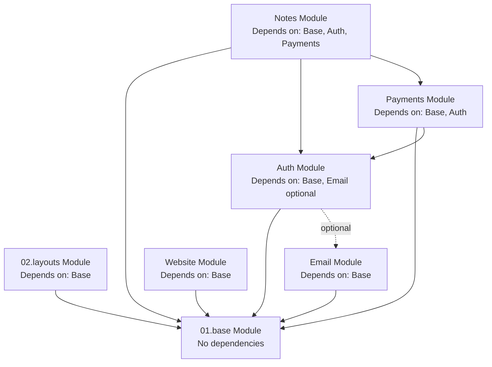

# Lekhan

> _Simple & fast note-taking app for capturing and organizing thoughts instantly._

## Vision Statement

> _Defines the singular problem this product solves and the outcome it creates. Helps AI agents reject features outside core purpose._

**One-sentence product essence:**

Help people capture and organize thoughts instantly without complexity.

## Primary Users

> _Identifies who benefits from this product and who doesn't. Prevents AI from building features for wrong audience._

**Who uses this product:**

- **Students**: Taking class notes and organizing study materials — need fast capture during lectures and quick retrieval when studying
- **Writers**: Capturing ideas and drafting content quickly — benefit from distraction-free markdown editor with instant save
- **Daily Note-Takers**: Personal journaling and thought organization — want simple, reliable place to capture thoughts without complexity

**NOT for:**

- Enterprise teams needing advanced permissions and audit logs
- Users requiring real-time collaboration (Google Docs-style editing)
- Power users needing advanced project management or task tracking features
- Teams requiring shared workspaces and role-based access control

## Technology Stack

> _Core technologies and platforms used. Helps AI understand technical constraints and available tools. Document WHAT technologies are used, never HOW they are implemented._

**Platform:**

- Web application (browser-based, server-side rendered)

**Primary Technologies:**

- **Language**: TypeScript
- **Framework**: Nuxt (Vue 3 full-stack SSR framework)
- **Database**: PostgreSQL
- **ORM**: Drizzle ORM with drizzle-zod for schema validation
- **State Management**: Pinia
- **UI Library**: @nuxt/ui (125+ accessible components with Tailwind CSS)
- **Editor**: Nuxt UI Editor Component (markdown editing with rich text interface)
- **Authentication**: better-auth with @polar-sh/better-auth extensions
- **Payment Processing**: @polar-sh/sdk (Polar payment platform)
- **Content Management**: @nuxt/content (markdown-based note storage and rendering)
- **Email Service**: unemail (multi-provider abstraction)
- **SEO**: @nuxtjs/seo (sitemap, meta tags, OG images, schema-org)
- **Image Optimization**: @nuxt/image with Vercel provider support

**Development Tools:**

- ESLint with @antfu/eslint-config and custom rules
- Vitest (unit testing with Vue Test Utils)
- Husky + lint-staged (pre-commit hooks)
- commitlint (conventional commit messages)
- Drizzle Kit (database migrations)

**Notes:**

- Uses PostgreSQL as the database
- Optimized for Vercel deployment with custom configurations
- Supports modern browsers (Chrome, Firefox, Safari, Edge)
- OAuth works with Google and GitHub providers by default
- Markdown editing powered by Nuxt UI Editor Component with rich text interface
- No offline support (web-only, requires internet connection)

## Core Value Proposition

> _Explains what makes this product valuable and different. AI uses this to prioritize features that strengthen core benefits._

**What makes this product valuable:**

1. **Instant Capture**: Write thoughts without waiting for app to load — instant save with auto-save every few seconds ensures nothing is lost
2. **Clean, Minimal UI**: No clutter or distractions — just a simple sidebar with notes and a focused markdown editor
3. **Fast Search**: Find any note instantly — full-text search across all notes with<100ms response time
4. **Markdown with Rich Text**: Best of both worlds — markdown power with visual rich text editing interface (no syntax memorization needed)
5. **Mobile-Responsive**: Works perfectly on any device — optimized for both desktop and mobile browsers

## Product Boundaries

> _Explicit scope fence defining what product does and doesn't do. Prevents feature creep and keeps AI focused. Includes both capabilities we build and deliberate exclusions with rationale._

### What We Build (In Scope)

**Note Creation & Editing:**

- Create and edit markdown notes with rich text editor (Nuxt UI Editor)
- Auto-save every few seconds (no manual save needed)
- Instant note creation (no loading delays)
- Drag-to-reorder notes in sidebar

**Note Organization:**

- Flat list of notes in sidebar (auto-organized as created)
- Fast full-text search across all notes
- No folders, tags, or manual categorization

**User Authentication:**

- User registration with email verification
- Email/password and magic link authentication
- OAuth social login (Google, GitHub)
- Password reset and account management

**Subscription Management:**

- Polar payment integration with checkout flows
- Subscription plan management (Starter, Pro, Max)
- Note limit enforcement per plan
- Customer billing portal access

### What We Don't Build (Deliberate Exclusions)

> _Features and capabilities this product will NOT provide, with clear rationale to prevent scope creep._

**Excluded capabilities:**

- **Real-time collaboration between users**: Adds complexity to sync infrastructure and conflict resolution. Lekhan optimizes for individual, private note-taking.
- **Rich media embedding (videos, audio, file attachments)**: Keeps product simple and fast. Media handling requires storage infrastructure and playback complexity beyond core value proposition.
- **Version history and change tracking**: Adds complexity to UI and storage. Users needing detailed version control should use dedicated tools.
- **Built-in task management features (to-dos, projects, Kanban)**: This is a note-taking app, not a project manager. Focus on simple note capture, not workflow management.
- **Native desktop/mobile apps**: Web-only keeps development focused. PWA capabilities provide app-like experience without platform-specific builds.
- **Public note sharing via links**: Notes are private by default. Sharing adds security surface area and complexity.
- **Folders, notebooks, or hierarchical organization**: Eliminates decision fatigue. Notes auto-organize chronologically with drag-to-reorder and fast search.
- **Trash/Archive functionality**: No soft deletes. Permanent deletion keeps storage clean and UI simple.
- **Offline mode**: Requires service workers and conflict resolution. Web-only with internet required keeps complexity low.

## Monetization & Pricing

> _Defines pricing tiers, plan features, and usage limits. Helps AI agents understand which features belong to which tier and enforce plan-based constraints during development._

### Pricing Model

**Revenue model:**

- **Model**: Subscription-only (no free plan)
- **Billing**: Monthly or yearly (20% discount on yearly)
- **Trial**: 7-day free trial of all plans, no credit card required

### Pricing Tiers

#### Starter Plan — $9/month or $86/year

**Target user:** Casual note-takers starting with Lekhan

**Features:**

- Create and edit markdown notes with rich text editor
- Auto-save functionality
- Fast full-text search
- Drag-to-reorder notes
- Mobile and desktop access
- OAuth and email/password authentication

**Limits:**

- Maximum 50 notes
- Unlimited storage (no storage limits)

#### Pro Plan — $19/month or $182/year

**Target user:** Active users needing more capacity

**Features:**

- All Starter plan features
- Higher note capacity

**Limits:**

- Maximum 200 notes
- Unlimited storage (no storage limits)

#### Max Plan — $29/month or $278/year

**Target user:** Power users with extensive note collections

**Features:**

- All Pro plan features
- Unlimited note capacity

**Limits:**

- Unlimited notes
- Unlimited storage (no storage limits)

### Plan Comparison

> _Quick reference table showing key differences between plans._

| Feature | Starter | Pro | Max |
|---------|---------|-----|-----|
| **Notes limit** | 50 | 200 | Unlimited |
| **Storage** | Unlimited | Unlimited | Unlimited |
| **Rich text editor** | ✅ | ✅ | ✅ |
| **Fast search** | ✅ | ✅ | ✅ |
| **Auto-save** | ✅ | ✅ | ✅ |
| **Mobile access** | ✅ | ✅ | ✅ |
| **OAuth login** | ✅ | ✅ | ✅ |
| **Drag to reorder** | ✅ | ✅ | ✅ |

### Upgrade/Downgrade Rules

> _Behavioral rules governing plan changes. AI agents use this to implement upgrade prompts and enforce downgrades correctly._

**Upgrade behavior:**

- New plan features activate immediately
- Note limit increases instantly
- User billed prorated amount for current billing cycle
- No data migration needed (everything already stored)

**Downgrade behavior:**

- Downgrade takes effect at end of current billing period
- If user exceeds new plan limits (e.g., 100 notes when downgrading to Starter's 50-note limit):
  - Existing notes remain accessible (read-only)
  - User cannot create new notes until below limit
  - User shown prompt to delete notes or upgrade
- No data deleted automatically

### Monetization-Driven Product Rules

> _Cross-module constraints related to plan enforcement. Supplements "Cross-Module Product Rules" section with monetization-specific invariants._

- **Note limit enforcement**: When user reaches plan limit, show upgrade prompt but never block access to existing notes
- **Trial expiration**: At end of 7-day trial, user must choose a paid plan to continue access
- **Payment failure**: After 3 failed payment attempts, user account suspended with 7-day grace period
- **All plans have full features**: No feature gating beyond note limits (all users get rich editor, search, auto-save)

### Upgrade Triggers

> _When and where product prompts users to upgrade. Guides AI agents on implementing conversion opportunities._

**Contextual upgrade prompts:**

- **Note limit reached**: When attempting to create note beyond plan limit, show modal: "You've reached your [plan] plan limit of [X] notes. Upgrade to [next plan] for [Y] notes." with upgrade CTA
- **Approaching limit**: When reaching 80% of note limit (e.g., 40/50 notes on Starter), show banner: "You're using 40 of 50 notes. Upgrade to Pro for 200 notes."
- **Settings page**: Always show current plan with "Upgrade" button and plan comparison

**Non-intrusive placement:**

- Settings page always shows current plan with "Upgrade" button
- Pricing page accessible from account menu
- Upgrade prompts dismissible (don't block workflow)

## Modules Overview

> _Lists all bounded contexts (modules) in this product, their responsibilities, and dependencies. Helps AI understand product structure and navigate to detailed module documentation._

**Note on Terminology**: In Lekhan, "Layer" is the technical Nuxt term for code organization, while "Module" is the conceptual term for bounded contexts. Each Nuxt Layer represents one module. Documentation uses "module" to describe responsibilities and boundaries.

### 01.base Module

**Responsibility:** Foundation layer providing core infrastructure, database schemas, utilities, and shared configuration  
**Key Capabilities:**

- PostgreSQL database schemas and migrations
- Shared utilities, composables, and stores
- Base middleware (global query parameter validation)
- Transition CSS animations
- App configuration defaults
- Nuxt UI customization configuration

**Path:** `/layers/01.base/`

### 02.layouts Module

**Responsibility:** Application layout components and layout-specific styling  
**Key Capabilities:**

- Layout components for consistent page structure (sidebar, command palette)
- Layout-specific composables and utilities
- Brand assets and styling overrides
- Dark/light mode support

**Path:** `/layers/02.layouts/`

### Auth Module

**Responsibility:** User authentication, authorization, session management, and account administration  
**Key Capabilities:**

- BetterAuth server setup with OAuth (Google, GitHub), magic link, email verification
- Database tables: users, sessions, accounts, verifications
- Auth middleware (public, private, guest, admin page groups)
- Auth pages: sign-in, sign-up, email verification, magic link
- User account management pages and settings
- Admin functionality with user impersonation

**Path:** `/layers/auth/`

### Notes Module

**Responsibility:** Core note-taking functionality — creation, editing, organization, and search  
**Key Capabilities:**

- Create and edit markdown notes with rich text editor (Nuxt UI Editor)
- Auto-save functionality (every 3 seconds)
- Flat list organization in sidebar with drag-to-reorder
- Fast full-text search across all user notes
- Note limit enforcement based on subscription plan
- Database tables: notes
- Private user-specific content (only owner can access)

**Path:** `/layers/notes/` _(to be created)_

### Email Module

**Responsibility:** Email service abstraction and template management  
**Key Capabilities:**

- Multi-provider email service (AWS SES, Resend, SMTP)
- Provider configuration based on environment
- Email templates (verification, magic link, password reset, welcome)
- Multi-sender support (security, events, alerts, system)

**Path:** `/layers/email/`

### Payments Module

**Responsibility:** Payment processing, subscription management, and plan limit enforcement via Polar  
**Key Capabilities:**

- Database tables: polar_subscriptions, polar_products, polar_orders
- Polar SDK client setup
- Checkout integration for Starter/Pro/Max plans
- Customer portal integration
- Subscription plan tracking and note limit enforcement
- Webhook handling for payment events
- Trial period management (7-day free trial)

**Path:** `/layers/payments/`

### Website Module

**Responsibility:** Public-facing website pages and legal/marketing content  
**Key Capabilities:**

- Marketing homepage
- Pricing page showcasing Starter/Pro/Max plans
- Legal content via Nuxt Content (terms, privacy)
- SEO-optimized landing pages

**Path:** `/layers/website/`

## Module Dependencies

> _Defines relationships between modules. Helps AI understand data flow and integration points. Prevents circular code dependencies while allowing bidirectional data relationships._

**Dependency Graph:**



**Detailed Dependencies:**

- **02.layouts Module** → depends on **01.base Module**
  - Reason: Layouts use base utilities, composables, and Nuxt UI configuration

- **Auth Module** → depends on **01.base Module**, optionally **Email Module**
  - Reason: Auth uses base database utilities; email integration is optional (wired to send auth emails but can work without it)

- **Notes Module** → depends on **01.base Module**, **Auth Module**, **Payments Module**
  - Reason: Notes require authenticated user for ownership; uses base database and content utilities; checks payment subscription for note limit enforcement

- **Email Module** → depends on **01.base Module**
  - Reason: Email uses base configuration and environment utilities

- **Payments Module** → depends on **01.base Module**, **Auth Module**
  - Reason: Payments require user authentication for customer linking and uses base database utilities

- **Website Module** → depends on **01.base Module**
  - Reason: Website uses base Nuxt Content configuration and shared utilities

**Notes:**

- 01.base Module has no dependencies (foundation layer)
- Modules can freely communicate and import from each other for code reuse
- Bidirectional data relationships allowed via foreign keys
- Notes module checks Payments module for subscription plan and note limits

## Cross-Module Product Rules

> _Product-wide standards and conventions that maintain consistency across all modules._

**Naming Conventions:**

- Database table names use snake_case
- Database type names follow pattern: `{TableName}Schema`, `New{TableName}`, `{TableName}`
- Zod schemas for database validation use snake_case
- Conventional commit message format required

**Architecture Standards:**

- Each module is a self-contained Nuxt Layer with `nuxt.config.ts`
- Shared configuration centralized in 01.base module
- Server code in `server/`, client code in `app/`
- Database schemas in module's `server/db/schemas/`

**Security Requirements:**

- Private pages require authenticated session via middleware
- Password reset emails use `security` sender category
- OAuth callbacks validate state parameter
- Session tokens are HTTP-only cookies
- **User data isolation enforced**: Users can only access their own notes, never other users' notes
- **Note ownership validation**: All note operations verify userId matches authenticated user

**Quality Standards:**

- TypeScript strict mode enabled
- Database migrations generated via Drizzle Kit
- Environment variables validated on startup
- Public routes generate sitemap entries
- Dark/light mode support for user-facing content

**Lekhan-Specific Rules:**

- **Auto-save interval**: All note edits auto-save every 3 seconds (enforced by Notes module)
- **Note limit enforcement**: When user reaches plan limit (Starter: 50, Pro: 200, Max: unlimited), prevent new note creation but allow editing existing notes
- **Performance target**: Note search and load operations must complete within 100ms perceived latency
- **No trash/archive**: Notes are permanently deleted immediately when user deletes (no soft delete, no recovery)
- **Flat organization only**: No folders, tags, or hierarchical categorization — notes displayed in flat list with drag-to-reorder

## Assumptions & Dependencies

> _Explicit assumptions about users and external systems. Helps AI validate if implementation environment matches product requirements._

### Assumptions

**User Capabilities:**

- Users have email address for account creation and authentication
- Users understand basic text editing (typing, selecting, copying, pasting)
- Users access Lekhan via modern web browser (Chrome, Firefox, Safari, Edge) on desktop or mobile
- Users have stable internet connection (no offline support)
- Users comfortable with markdown formatting or can use visual rich text editor without markdown knowledge

**User Context:**

- Users expect instant response times (<100ms for interactions)
- Users value simplicity over advanced organization features
- Users trust auto-save and don't expect manual save buttons
- Users understand subscription plans and note limits

### External Dependencies

**Required Services:**

- **PostgreSQL Database Server**: Relational database for all persistent data (users, sessions, notes, subscriptions)
- **Email Provider**: One of AWS SES, Resend, or SMTP server for transactional emails (verification, password reset, welcome)
- **Payment Provider**: Polar account and API credentials for subscription payment processing and plan management
- **Hosting Platform**: Vercel or similar Node.js SSR-compatible hosting with HTTPS support

**Optional Services:**

- **OAuth Provider Apps**: Google OAuth 2.0 app and/or GitHub OAuth app for social authentication (can disable if email-only authentication preferred)

**Third-Party SDK Dependencies:**

- Polar SDK for payment API communication and subscription management
- Better Auth for authentication flows and session management
- Nuxt UI Editor for markdown rich text editing interface

## Glossary

> _Product-wide terminology used consistently across all modules and documentation. Prevents ambiguity in behavioral descriptions. Module-specific terms live in module READMEs._

**Product-level terminology:**

- **Lekhan**: The note-taking app product itself; simple & fast note-taking for capturing and organizing thoughts
- **Note**: A single markdown document created and owned by a user; the core content unit in Lekhan
- **User**: A registered account holder with authenticated session who can create and manage notes
- **Plan**: Subscription tier (Starter, Pro, Max) with specific note limits and pricing
- **Note Limit**: Maximum number of notes allowed based on user's subscription plan (Starter: 50, Pro: 200, Max: unlimited)
- **Auto-Save**: Automatic saving of note content every 3 seconds without manual user action
- **Sidebar**: Flat list of user's notes displayed in sidebar navigation with drag-to-reorder capability
- **Rich Text Editor**: Visual markdown editing interface (Nuxt UI Editor) requiring no markdown syntax knowledge
- **Layer**: Technical Nuxt term for code organization unit; synonymous with "Module" in conceptual documentation
- **Module**: Bounded context representing one domain area (auth, notes, payments, etc.); implemented as Nuxt Layer

_Module-specific terms are defined in respective module READMEs._

## Information Architecture

> _Directory structure showing where AI agents find behavioral knowledge. Each path contains specific types of product information._

```
<root>/
├─ docs/                             # complete behavioral knowledge base
│  ├─ README.md                      # product vision, scope, constraints (THIS FILE)
│  ├─ user-journeys/                 # end-to-end behavioral outcomes
│  │  └─ <journey>.md                # narrative + acceptance truth
│  └─ modules/                       # domain-isolated knowledge units
│     └─ <module>/                   # single bounded context
│        ├─ README.md                # responsibilities + boundaries
│        ├─ user-stories/            # atomic behavioral goals
│        │  └─ <story>.md            # intent + acceptance criteria
│        ├─ database-design.md       # domain entities + relationships
│        ├─ frontend/                # user experience definition only
│        │  └─ pages/                # URL-level behavioral surfaces
│        │     └─ <page>/            # single user interaction boundary
│        │        ├─ README.md       # goals, content, user actions
│        │        └─ wireframe.md    # indented spacing + ASCII mini-map wireframe
│        └─ backend/                 # non-UI system capabilities
│           └─ api/                  # behavioral API contracts
│              └─ <route>/           # endpoint path boundary
│                 └─ <method>/       # HTTP method (get, post, patch, delete, etc.)
│                    ├─ README.md    # params, responses, rules, errors
│                    └─ tests.md     # behavioral verification cases
└─ layers/                           # actual implementation (code)
   ├─ 01.base/                       # base module implementation
   ├─ 02.layouts/                    # layouts module implementation
   ├─ auth/                          # auth module implementation
   ├─ notes/                         # notes module implementation (TO BE CREATED)
   ├─ email/                         # email module implementation
   ├─ payments/                      # payments module implementation
   └─ website/                       # website module implementation
```

**Authority Hierarchy:**

When documentation conflicts, higher authority wins:

```
docs/README.md > journeys/*.md > modules/*/README.md > user-stories/*.md > pages/*/README.md > database-design.md
```

## Architectural Philosophy (Conceptual)

> _High-level design principles guiding technical decisions across all modules. Helps AI choose implementation approaches aligned with product values. No specific technologies mentioned._

**Guiding principles:**

- **Speed First**: Optimize for instant perceived performance (<100ms) — instant note creation, instant search results, instant auto-save feedback
- **Simplicity Over Features**: Favor minimal UI and workflows over advanced features — no folders, no tags, no complex organization
- **Invisible Reliability**: Auto-save should be invisible yet trustworthy — users never worry about losing work
- **Data Durability**: Favor preserving user content over feature convenience — always confirm destructive delete actions, no accidental data loss
- **Mobile-First Responsive**: All interactions work perfectly on mobile and desktop — touch-friendly, keyboard-friendly
- **Type Safety First**: Leverage TypeScript strict mode; validate data at boundaries; generate types from database schemas
- **User Data Isolation**: User can only access their own notes, never other users' data — enforced at database and API layers
- **Progressive Enhancement**: Core note editing works without JavaScript; enhance with auto-save and search client-side
- **Plan Limit Enforcement**: Hard limits on note creation based on subscription plan, but existing notes always accessible
- **Documentation-Driven**: Document behavioral intent in `/docs` before implementation; AI agents use documentation as source of truth

## AI Agent Development Workflow

> _Step-by-step process for AI agents working on this product. Covers understanding, planning, implementation, validation, and maintenance across the entire development lifecycle._

### Phase 1: Understanding Product Context

**When starting any task:**

1. Read **this README** for:
   - Product vision and value proposition (what makes Lekhan unique)
   - Module overview and responsibilities (which modules own what)
   - Cross-module product rules (code quality, architecture, security)
   - Architectural philosophy (how to evolve without breaking)

2. Review **module dependency graph** to understand:
   - Which modules your task affects
   - Integration points between modules (e.g., Auth → Email for verification, Notes → Payments for plan limits)
   - Data flow and relationships (e.g., Payments depends on Auth for user linking)

3. Read **relevant module READMEs** for:
   - Domain model (entities and relationships)
   - Module-specific rules and boundaries
   - UX philosophy and interaction patterns
   - Public APIs (composables, utilities) available to other modules

4. Review **journeys** that involve your task (when available):
   - End-to-end user flows (e.g., "User signs up → verifies email → creates first note → reaches plan limit → upgrades")
   - Acceptance criteria for each step
   - Cross-module interactions

**Determinism Check:**  
_Can you explain what your task affects without reading code?_  
If no → documentation incomplete, ask human for clarification or create missing documentation first.

### Phase 2: Planning Changes

**Before writing any code:**

1. **Identify affected modules:**
   - Which module owns this feature?
   - Which modules does it integrate with?
   - Example: Adding note search affects Notes (owns notes content) and Auth (validates user ownership)

2. **Check constraints:**
   - Review cross-module product rules (code quality, security, architecture, Lekhan-specific rules)
   - Check module boundaries (is this scope creep into another module?)
   - Verify architectural philosophy alignment (speed first, simplicity, data durability, etc.)

3. **Validate dependencies:**
   - Will this create new module dependencies? (Check module dependency graph)
   - Are circular code dependencies introduced? (Forbidden - use contracts/composables instead)
   - Are bidirectional data relationships needed? (Allowed via foreign keys in database)

4. **Draft implementation plan:**
   - Write acceptance criteria (what defines "done"?)
   - List test scenarios (unit tests, integration tests, edge cases)
   - Identify edge cases (validation errors, network failures, missing data)
   - Note documentation updates needed (module README, API contracts, user stories)

5. **Human review checkpoint:**
   - Present plan to human for approval
   - Clarify any ambiguous requirements
   - Get approval before proceeding to implementation

### Phase 3: Implementation

**During development:**

1. **Test-Driven Development (TDD):**
   - Write tests first using Vitest (define expected behavior)
   - Run tests → expect failure (red phase)
   - Implement minimal code to pass tests (green phase)
   - Refactor for clarity and maintainability
   - Repeat until feature complete

2. **Respect module organization:**
   - Keep related functionality within appropriate module
   - Modules can import from each other as needed
   - Maintain clear separation of concerns

3. **Follow code quality rules:**
   - Use snake_case for database table names
   - Use TypeScript strict mode (no `any`, properly typed)
   - Validate input with Zod schemas
   - Don't use `statusCode` or `statusMessage` in `createError()`
   - Follow conventional commit format in commit messages
   - And others

4. **Apply architectural philosophy:**
   - Speed first (instant perceived performance <100ms)
   - Simplicity over features (minimal UI, no complex organization)
   - Invisible reliability (auto-save trustworthy)
   - Data durability (preserve user content, confirm deletes)
   - User data isolation (enforce userId checks)
   - Type safety first (generate types from schemas)
   - Plan limit enforcement (check subscription before note creation)

5. **Database changes (if needed):**
   - Update schema in appropriate module's `server/db/schemas/`
   - Use snake_case for table and column names
   - Generate migration with `pnpm db:generate`
   - Test migration with `pnpm db:migrate`
   - Update `database-design.md` documentation

### Phase 4: Validation

**Before marking task complete:**

1. **All tests pass:**
   - Unit tests for new code
   - Integration tests for cross-module interactions
   - Edge case coverage (errors, validation failures)
   - Type checking passes (`pnpm typecheck`)

2. **Cross-module rules respected:**
   - No violations of product-wide constraints
   - Module boundaries maintained (no scope creep)
   - Code quality standards met (ESLint passes)
   - Pre-commit hooks pass (linting, type checking)

3. **Dependencies validated:**
   - Module dependency graph unchanged (or explicitly updated in this README if new dependency justified)
   - No circular code dependencies introduced (Module A → Module B → Module A forbidden)
   - Bidirectional data relationships documented if added (e.g., foreign keys)

4. **User journeys still achievable:**
   - Affected journeys still work end-to-end
   - Acceptance criteria met for all impacted user stories
   - No existing workflows broken

5. **Quality maintained:**
   - Code follows established patterns
   - Documentation updated to reflect changes
   - No regressions in existing functionality

### Phase 5: Documentation Maintenance

**After implementation complete:**

1. **Update module README if:**
   - New entities added to domain model
   - New module rules introduced
   - Module responsibilities changed
   - Public APIs (composables, utilities) added or modified
   - Database schema changed

2. **Update this product README if:**
   - New module added to Lekhan
   - Module dependencies changed (update dependency graph)
   - Cross-module rules added/modified
   - Product boundaries changed (new capabilities or exclusions)
   - Technology stack updated (new major dependency)

3. **Update journeys if:**
   - User flow changed (new steps, removed steps)
   - New user journey created
   - Acceptance criteria modified

4. **Update glossary if:**
   - New product-wide terminology introduced
   - Existing terms redefined or clarified

5. **Update user stories if:**
   - Acceptance criteria changed
   - New stories added
   - Stories deprecated or completed

**Documentation First Principle:**  
_If behavior changed, documentation MUST change before code is merged._  
Documentation is source of truth; code implements documentation.

### Common Workflows

**Adding a new feature to existing module:**

```
Phase 1 (understand module context) → Phase 2 (plan + human review) → Phase 3 (TDD implementation) → Phase 4 (validate) → Phase 5 (document)
```

**Adding a new module:**

```
Phase 1 (understand product boundaries) → Phase 2 (plan module responsibilities, dependencies, public APIs + human review) → Create module README → Phase 3 (implement) → Phase 4 (validate) → Phase 5 (update product README with new module + dependency graph)
```

**Fixing a bug:**

```
Phase 1 (understand affected modules) → Phase 3 (TDD fix with regression test) → Phase 4 (validate no new issues) → Phase 5 (update docs if behavior clarified)
```

**Refactoring code:**

```
Phase 1 (understand module) → Phase 4 (ensure no behavioral changes via existing tests) → Phase 5 (update module README only if public APIs changed)
```

### Escalation Points

**When to ask human for help:**

- Documentation conflicts detected (e.g., this README contradicts module README)
- Cross-module rules unclear or contradictory
- Module organization ambiguous (which module should own this responsibility?)
- New module needed (requires product-level architectural decision)
- Major architectural changes (switching core dependencies, major refactoring)
- Security implications unclear (authentication, authorization, data access)
- Performance trade-offs unclear (caching strategy, database indexing)

## Notes for Future AI Agents

- **This document defines WHAT at product level, never HOW**: Technologies listed (PostgreSQL, Better Auth, Polar, Nuxt UI Editor) describe WHAT is used, not HOW to configure or implement them. Implementation details live in code and inline comments.
- **All product-wide behavioral truth flows from here**: When in doubt, this README is highest authority. Module READMEs provide module-specific detail but cannot contradict this file.
- **Module-specific details live in module READMEs**: Don't bloat this file with implementation details. Link to module docs for deep dives.
- **If contradictions found, this README wins**: Escalate to human if contradiction seems wrong, but assume this file is correct until clarified.
- **Implementation may change; product definition must not**: Code can be refactored, but vision (simple & fast note-taking), users (students, writers, daily note-takers), boundaries (no folders/tags/trash), and modules remain stable. Changes here require human approval.
- **Speed and simplicity are non-negotiable**: Any feature that slows down note creation, search, or editing contradicts core value proposition. Any feature adding UI complexity contradicts simplicity philosophy.
- **Layers = Modules in mental model**: "Layer" is Nuxt technical term; "Module" is conceptual bounded context. Use "module" in documentation for clarity.
- **Documentation-driven development**: Write or update `/docs` before writing code. Documentation is source of truth; code implements documentation.
